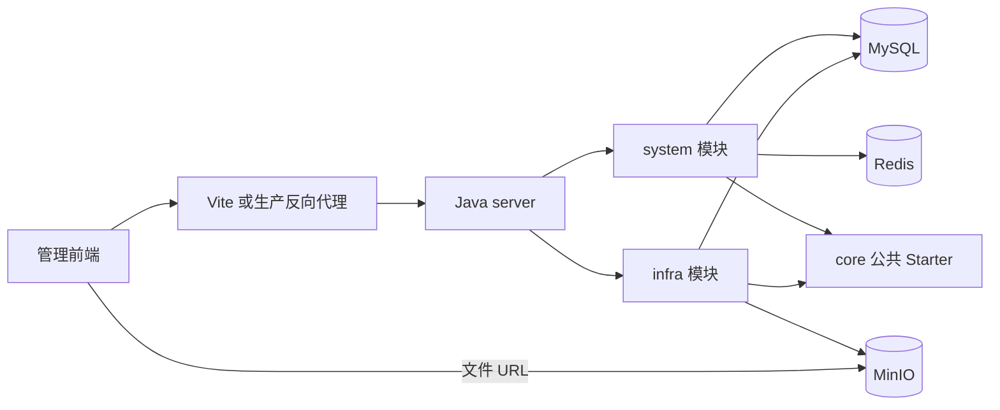

# basic-framework 总体架构

## 摘要

框架由一套管理前端和一个 Spring Boot 后端组成，提供系统管理与基础设施能力，业务开发在此基础上增加自己的模块和页面。MySQL 保存持久数据，Redis 提供令牌、验证码和缓存，MinIO 保存文件内容。Java 的 Maven 模块属于同一进程，不是独立微服务。

## 目录

- [系统边界](#系统边界)
- [调用与数据归属](#调用与数据归属)
- [新增业务的落点](#新增业务的落点)
- [认证与运行边界](#认证与运行边界)
- [深入探索](#深入探索)

## 系统边界

使用框架时，从实际提取的工程选择扩展点；目录中的通用工具不代表已经提供对应业务系统。

| 工程 | 仓库位置 | 主要职责 |
| --- | --- | --- |
| 管理前端 | `前端代码/basic-framework-admin` | 登录、系统管理、基础设施管理、个人中心；应用源码在 `apps/web-ele/src` |
| Java 后端 | `后端代码/basic-framework-boot` | system、infra 模块与公共 Starter；server 聚合启动 |
| 数据库资料 | `数据库文件` | SQL 结构与初始化数据；导入前核对目标库和重建语句 |
| 服务器部署 | `docs/部署` | 中间件、应用、HTTPS 网关安装与离线交付 |
| 工程工具 | `scripts`、前端工程内 `scripts` | 文档、注释、依赖关系、测试与交付检查 |

AI、Workflow、推理、转码、媒体服务和另一套业务前端不在当前框架内。代码生成器、数据源管理、多存储配置、公告与站内通知也不是现有业务能力；新增业务不能只恢复菜单就认为已经接入。

## 调用与数据归属

前端通过 Java 管理 API 读写业务数据；文件下载使用服务端返回的对象地址，地址必须从浏览器所在网络可达。

| 数据 | 主要持有位置 | 使用约定 |
| --- | --- | --- |
| 用户、角色、菜单、部门、岗位、字典、参数与日志 | MySQL | 对应模块 Service 管理规则；Mapper 管理查询与持久化 |
| OAuth2 access/refresh Token | MySQL；access Token 同时缓存于 Redis | 令牌服务负责创建、校验、刷新与撤销，不能把它当作无状态 JWT |
| 验证码、权限关系与 Spring Cache 数据 | Redis | 由对应 DAO 或缓存注解维护；直接改数据库可能绕过缓存失效 |
| 文件内容 | MinIO | infra 唯一文件存储客户端读写；配置来自环境，不从数据库选择存储方案 |
| 文件名称、路径、URL 等元数据 | MySQL | 文件 Service 登记、查询与删除；对象写入和数据库写入不是同一事务 |
| 调度任务和执行日志 | infra 数据表；Quartz 调度器 | handler 必须是当前应用可加载的 Bean；持久化调度需另外配置 Quartz JDBC 存储 |

## 新增业务的落点

业务功能放入自己的 Maven 模块和前端页面，使用已有公共能力；不要把订单、库存等业务规则加入 server 或 core。

1. 在 Java 聚合工程增加业务 module，维护其 POM，并在 server POM 引入模块；启动扫描覆盖 `com.basicframework.module`，新包应遵循该边界。
2. HTTP 入口放在业务模块 `controller/admin`，请求与响应用 VO，稳定跨模块能力通过提供方 `api` 与 DTO 暴露。Controller 调 Service，Service 通过 Mapper、模块 API 或客户端访问资源；DO 不直接成为接口契约。
3. 使用现有分页与结果模型、权限表达式、异常体系和数据权限 Starter。SQL 与索引、部门过滤等设计需要结合真实业务，不假设加上注解就自动隔离所有查询。
4. 在管理前端 `src/api` 增加类型与接口函数，`src/views` 增加页面。菜单的组件地址必须与页面映射一致，权限码须与后端操作入口一致，并通过角色授权生效。
5. 验收完整调用链：菜单可访问、表单请求正确、无权限操作被后端拒绝、数据边界有效、失败不留脏状态。构建和路由可见不能代替这些验证。

上述五步的**唯一操作契约**（可复制的 CRUD 工程模板、占位符替换规则、逐步接入清单与各阶段验证命令）见[新增业务模块模板](../开发指南/新增业务模块模板/README.md)。框架不提供后台产品级代码生成器；模板可手工实例化，但必须完成后端装配、迁移、同平台菜单与角色授权、前端组件映射及真实 API 接入，并通过现行门禁与端到端验收。模板生成成功不等于模块接入完成。

## 认证与运行边界

运行配置按执行进程的工作目录读取，容器地址与宿主机地址不可混用。

- 开发前端使用 `/admin-api`，Vite 转发至 Java 的同名前缀；生产构建基础路径为 `/admin/`。反向代理要保留 API 前缀，并与构建基础路径配合。
- 账号密码界面调用 `/system/auth/super-admin-login`，服务端还保留普通登录及其他认证入口。各入口约束以认证实现和数据库用户、角色、菜单的平台类型为准；一套前端不等于已经删除这些类型校验。
- 路由与按钮权限用于界面控制，Java Security 与操作入口仍负责实际授权。公开文件 URL 的读权限与用户 Token 是不同机制。
- Java 核心运行需要 MySQL、Redis、MinIO。当前业务模块没有装配 RabbitMQ 消费链；MQ Starter 源目录的存在不构成启动 RabbitMQ 的要求。
- 框架未提供完整生产 Compose；中间件与应用按通用部署步骤安装，生产配置、TLS、数据库和对象存储备份按环境准备。

## 深入探索

按要完成的工作选择分册，避免把总体图当作接口或部署清单。

- [管理前端](01-管理前端.md)：启动、配置、菜单、请求与页面扩展。
- [Java 后端](03-Java后端.md)：模块、分层、安全、缓存和文件调用链。
- [部署说明](../部署/部署说明.md)：构建产物、目标环境与验收。
- [测试策略](../测试与可靠性/测试策略.md)：选择与行为风险匹配的测试。
