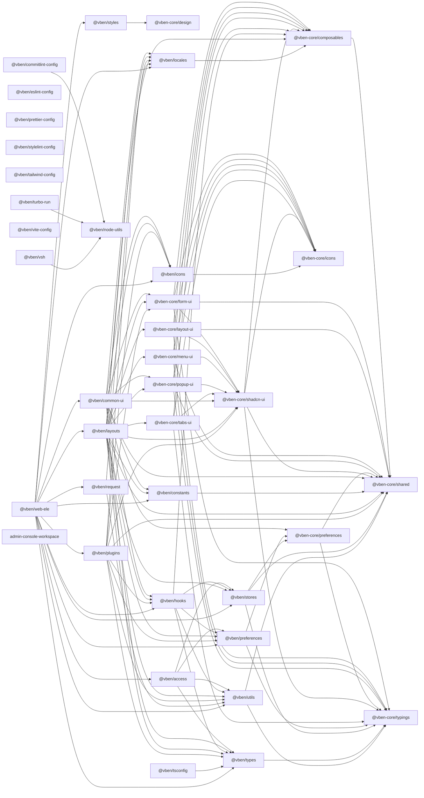
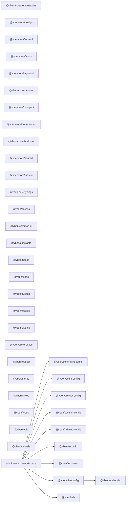

<!-- 由 generate_module_graph.py 生成，请勿手工编辑。 -->

# 模块依赖关系图

## 摘要

当前工作区共 38 个包、117 条分类依赖。箭头由使用方指向被依赖包；依据清单声明，不代表源码调用图。

---

## 目录

- [包清单](#包清单)
- [运行依赖](#运行依赖)
- [开发依赖](#开发依赖)
- [可选依赖](#可选依赖)
- [宿主依赖](#宿主依赖)
- [开发笔记](#开发笔记)

---

## 包清单

| 包 | 所属清单 |
| --- | --- |
| @vben-core/composables | [package.json](../../packages/%40core/composables/package.json) |
| @vben-core/design | [package.json](../../packages/%40core/base/design/package.json) |
| @vben-core/form-ui | [package.json](../../packages/%40core/ui-kit/form-ui/package.json) |
| @vben-core/icons | [package.json](../../packages/%40core/base/icons/package.json) |
| @vben-core/layout-ui | [package.json](../../packages/%40core/ui-kit/layout-ui/package.json) |
| @vben-core/menu-ui | [package.json](../../packages/%40core/ui-kit/menu-ui/package.json) |
| @vben-core/popup-ui | [package.json](../../packages/%40core/ui-kit/popup-ui/package.json) |
| @vben-core/preferences | [package.json](../../packages/%40core/preferences/package.json) |
| @vben-core/shadcn-ui | [package.json](../../packages/%40core/ui-kit/shadcn-ui/package.json) |
| @vben-core/shared | [package.json](../../packages/%40core/base/shared/package.json) |
| @vben-core/tabs-ui | [package.json](../../packages/%40core/ui-kit/tabs-ui/package.json) |
| @vben-core/typings | [package.json](../../packages/%40core/base/typings/package.json) |
| @vben/access | [package.json](../../packages/effects/access/package.json) |
| @vben/commitlint-config | [package.json](../../internal/lint-configs/commitlint-config/package.json) |
| @vben/common-ui | [package.json](../../packages/effects/common-ui/package.json) |
| @vben/constants | [package.json](../../packages/constants/package.json) |
| @vben/eslint-config | [package.json](../../internal/lint-configs/eslint-config/package.json) |
| @vben/hooks | [package.json](../../packages/effects/hooks/package.json) |
| @vben/icons | [package.json](../../packages/icons/package.json) |
| @vben/layouts | [package.json](../../packages/effects/layouts/package.json) |
| @vben/locales | [package.json](../../packages/locales/package.json) |
| @vben/node-utils | [package.json](../../internal/node-utils/package.json) |
| @vben/plugins | [package.json](../../packages/effects/plugins/package.json) |
| @vben/preferences | [package.json](../../packages/preferences/package.json) |
| @vben/prettier-config | [package.json](../../internal/lint-configs/prettier-config/package.json) |
| @vben/request | [package.json](../../packages/effects/request/package.json) |
| @vben/stores | [package.json](../../packages/stores/package.json) |
| @vben/stylelint-config | [package.json](../../internal/lint-configs/stylelint-config/package.json) |
| @vben/styles | [package.json](../../packages/styles/package.json) |
| @vben/tailwind-config | [package.json](../../internal/tailwind-config/package.json) |
| @vben/tsconfig | [package.json](../../internal/tsconfig/package.json) |
| @vben/turbo-run | [package.json](../../scripts/turbo-run/package.json) |
| @vben/types | [package.json](../../packages/types/package.json) |
| @vben/utils | [package.json](../../packages/utils/package.json) |
| @vben/vite-config | [package.json](../../internal/vite-config/package.json) |
| @vben/vsh | [package.json](../../scripts/vsh/package.json) |
| @vben/web-ele | [package.json](../../apps/web-ele/package.json) |
| admin-console-workspace | [package.json](../../package.json) |

---

## 运行依赖

---

## 开发依赖

---

## 可选依赖

```mermaid
flowchart LR
  p0["@vben-core/composables"]
  p1["@vben-core/design"]
  p2["@vben-core/form-ui"]
  p3["@vben-core/icons"]
  p4["@vben-core/layout-ui"]
  p5["@vben-core/menu-ui"]
  p6["@vben-core/popup-ui"]
  p7["@vben-core/preferences"]
  p8["@vben-core/shadcn-ui"]
  p9["@vben-core/shared"]
  p10["@vben-core/tabs-ui"]
  p11["@vben-core/typings"]
  p12["@vben/access"]
  p13["@vben/commitlint-config"]
  p14["@vben/common-ui"]
  p15["@vben/constants"]
  p16["@vben/eslint-config"]
  p17["@vben/hooks"]
  p18["@vben/icons"]
  p19["@vben/layouts"]
  p20["@vben/locales"]
  p21["@vben/node-utils"]
  p22["@vben/plugins"]
  p23["@vben/preferences"]
  p24["@vben/prettier-config"]
  p25["@vben/request"]
  p26["@vben/stores"]
  p27["@vben/stylelint-config"]
  p28["@vben/styles"]
  p29["@vben/tailwind-config"]
  p30["@vben/tsconfig"]
  p31["@vben/turbo-run"]
  p32["@vben/types"]
  p33["@vben/utils"]
  p34["@vben/vite-config"]
  p35["@vben/vsh"]
  p36["@vben/web-ele"]
  p37["admin-console-workspace"]
```

---

## 宿主依赖

---

## 开发笔记

生成与验证

在所属前端运行 pnpm graph:modules 生成，pnpm graph:modules:check 只读检查是否最新。外部包、动态加载和源码调用不在图中。生成顺序固定；循环依赖按原边保留，不伪装成拓扑顺序。

